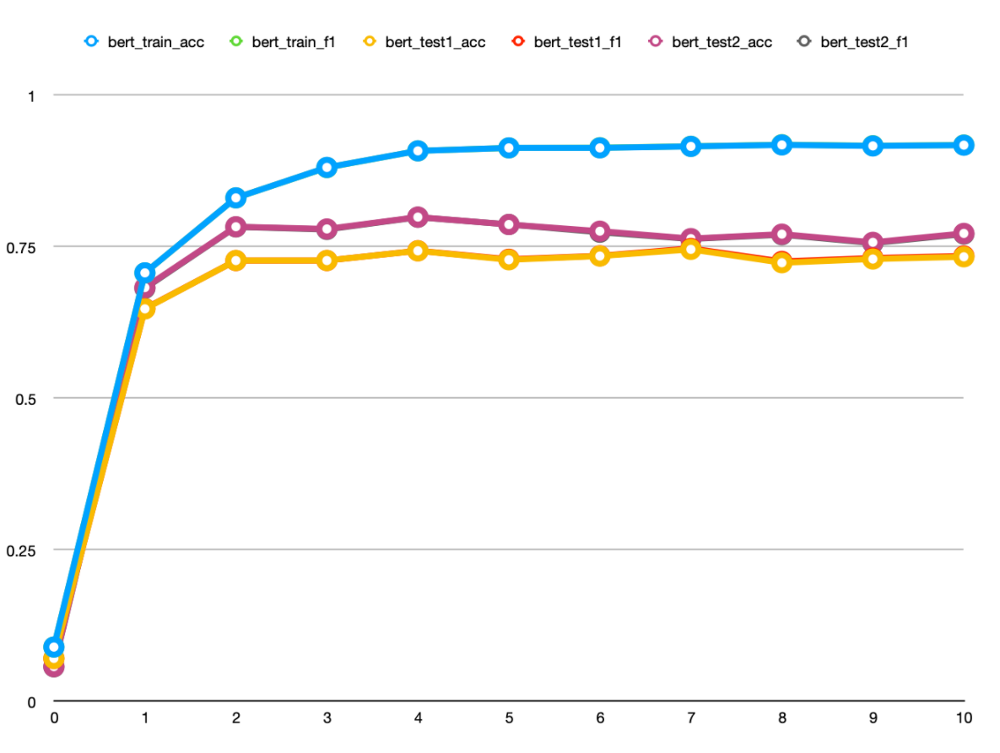

# **Track2: Interactive Argument Pair Identification in Online Forum**

This project serves as the baseline model for **[Argumentative-Text-Understanding-for-AI-Debater-NLPCC2021](https://github.com/AIDebater/Argumentative-Text-Understanding-for-AI-Debater-NLPCC2021) Track 2: Interactive Argument Pair Identification in Online Forum**.

## 0. Preprocessing

### 0.1 Dataset

Please refer to the [official website](http://www.fudan-disc.com/sharedtask/AIDebater21/index.html) for competition registration and dataset downloading.

This project uses `train.txt` and `test.txt` provided in the first phase of the competition, the default path of these files are at `./data/`, which can be modified in `config.json`.

The dataset used in this project contains 11,565 training instances and 1,481 testing instances. The composition of each line (containing 12 fields) is as follows:

$$
c_q\#q \#r_p\#c_p\#r_n^1\#c_n^1\#r_n^2\#c_n^2\#r_n^3\#c_n^3\#r_n^4\#c_n^4
$$
where each field represents:

1. $c_q$: Context of the quotation argument.
2. $q$: The quotation argument.
3. $r_p$: The positive reply.
4. $c_p$ : Context of the positive reply.
5. $r_n^i$: The $i$-th negative reply.
6. $c_n^i$: Context of the $i$-th negative reply.

Note: An instance of the dataset has already been shown in the  [official website](http://www.fudan-disc.com/sharedtask/AIDebater21/index.html).

### 0.2 Requirements

- Python >= 3.6 and PyTorch >= 0.4.1

- Other required packages can be found in `requirements.txt` and can be installed by:

  ```
  pip install -r requirements.txt
  ```

## 1. Training

### 1.1 Training Process

The baseline provided is based on `BertForSequenceClassification` model, which takes the quotation argument and each reply argument as a sentence pair, and compute its probability of being an interactive argument pair. We use `Early Stopping` to alleviate over-fitting.

We automatically divide the training dataset into train and valid dataset in the training process, named as `train_data.txt` and `valid_data.txt` repectively.

Our baseline model is trained on one NVIDIA 1080Ti GPU, the training hyperparameters can be modified in `config.json`. You can train the baseline model by simply running the following command:

```shell
python -m torch.distributed.launch train,py
```

### 1.2 Training Results

After the training period, the project file contains:

```
├── config.json
├── data
│   ├── train.txt
│   ├── train_data.txt
│   └── valid_data.txt
├── model
│   ├── BERT
│   │   └── model.bin
├── __init__.py
├── data.py
├── main.py
├── model.py
├── train.py
└── utils.py
```

Note that after each epoch, the best model is saved in `./model/`.

The baseline model's performance in the training period is as shown below.



## Evaluation and Submission

To evaluate the trained model and generate the submission file, you can simply run the following command:

```
python main.py
```

The program will then output the model's performance on the test set and generate the submission csv file (which will be required at the end of phase 1 and the whole process of phase 2).

## Citation

```markdown
@article{ji2019discrete,
  title={Discrete Argument Representation Learning for Interactive Argument Pair Identification},
  author={Ji, Lu and Wei, Zhongyu and Li, Jing and Zhang, Qi and Huang, Xuanjing},
  journal={arXiv preprint arXiv:1911.01621},
  year={2019}
}
```
